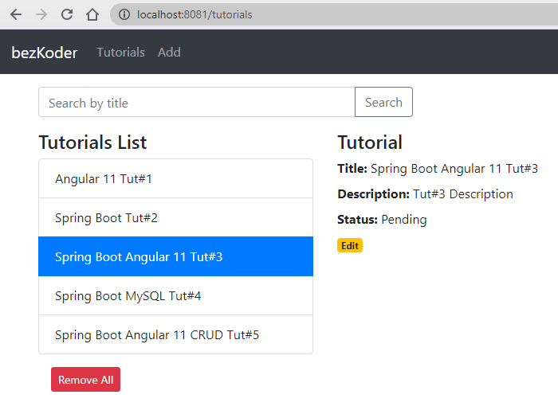

## Time : 2 days (From Project 1-6)
# Spring Boot + Angular 11 CRUD example with MySQL Database

In this Project, we will learn how to build a full stack Angular 11 + Spring Boot example with a CRUD App. The back-end server uses Spring Boot with Spring Web MVC for REST Controller and Spring Data JPA for interacting with MySQL database. Front-end side is made with Angular 11, HTTPClient & Router.

We will build a full-stack Tutorial Application in that:

- Each Tutorial has id, title, description, published status.
- We can create, retrieve, update, delete Tutorials.
- We can also find Tutorials by title.
- The images below shows screenshots of our System.

Add an object:

Retrieve all objects:

Click on **Edit** button to go to a Tutorial page:

On this Page, you can:

- change status to *Published* using **Publish** button
- delete the Tutorial using **Delete** button
- update the Tutorial details with **Update** button

Search Tutorials by title:

## Angular 11 & Spring Boot CRUD Architecture
This is the application architecture we will build:

- Spring Boot exports REST Apis using Spring Web MVC & interacts with MySQL Database using Spring Data JPA.
- Angular Client sends HTTP Requests and retrieve HTTP Responses using axios, shows data on the components. We also use Angular Router for navigating to pages.

## Project 1 
* task 1 : Go through the code of the application. understand about the ports to expose to connect the frontend backend and the database mysql.
* task 2 : Run the application in local environment and check the connectivity with the database.
* task 3 : Create a repository on your github account and push the code there using cli.

## Project 2
* task 1 : Create dockerfile for frontend and backend and containerize the frontend and backend.
* task 2 : Run the containers on localhost. make sure that after running frontend backend and database of the application is running fine and the database is connected.
* task 3 : Push the Dockerfile on your github repository.
* task 4 : Attach volume with the containers.

## Project 3
* tast 1 : Create jenkins CI job to automate the build of image for frontend and backend and push it on docker hub whenever there is any change in the code the pipeline will triggered automatically.
* task 2 : Create jenkins CD jobs to host the application on local environment.
* task 3 : Link the jobs(up-stream and down-stream). If the build job successfully run the cd will trrigers automatically. 

## Project 4
* task 1 : Create manifest files to host the application on minikube(k8s). Create seprate deployment and services for frontend, backend and mysql servers.
* task 2 : Host the application on minikube locally.
* task 3 : Replicas of frontend are 10 and backend are 10 and one mysql database.
* task 4 : Make a new github repository and push the yamls on github repository.

## Project 5
* task 1 : Create jenkins CD jobs to host the application on a minikube environment.

## Project 6
* task 1 : clone the new version of the application v2 from the github repo https://github.com/sh-cmd/node-project-giit-v2.git .
* task 2 : Push the applcation in new branch named Dev
* task 3 : Create a dev environment for the application.
* task 4 : Update the virsion 2 of the application on the dev environment using k8s menifest file with the rolling update strategy. Make sure the minReadySeconds will be 10 sec and the maxUnavailable pods will be 2 and maxSurge will be 2.
* task 5 : If the application is updated with no downtime than update the application version v2 by merging the branch on master.
